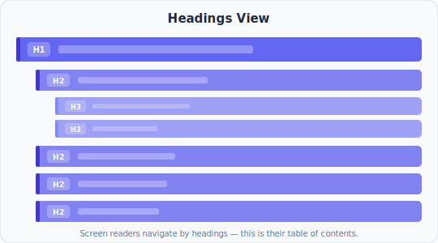

# Reading the Headings View

> The Headings view matches the output of [`outlineSnapshot()`](/packages/testing/snapshots#outlinesnapshot-root) in the testing package — same ordering, same formatting. Whether you're reading it in the Chrome extension, the Storybook addon, a committed Playwright snapshot fixture, the [`real-a11y outline`](/packages/cli) command, or the [`get_heading_outline`](/packages/mcp) MCP tool, this page applies.

The Headings view answers one question: **can a screen reader user navigate this page by structure?**

Headings are how screen reader users scan a page — the same way sighted users scan titles and section labels. The Headings view extracts every `<h1>` through `<h6>` and shows them as a leveled outline, like a table of contents.



<p style="color: var(--vp-c-text-3); font-size: 0.9em; margin-top: -0.5rem; text-align: center;">Each bar is one heading. The indentation shows the level — H1 at the top, H2 nested under it, H3 nested under H2.</p>

---

## What you see

Each row is one heading element, in document order. For each one you'll see:

- **The heading level** — `H1`, `H2`, `H3`, `H4`, `H5`, or `H6`
- **The accessible name** — the text content of the heading (what gets announced)
- **Indentation** — deeper levels are indented further, showing the nesting visually

---

## How heading levels work

Heading levels create a hierarchy — like an outline in a word processor:

- **`<h1>`** is the page title. There should be exactly one per page.
- **`<h2>`** marks major sections under the page title.
- **`<h3>`** marks subsections within an `<h2>` section.
- And so on, down to `<h6>`.

The level number indicates depth, not visual size. CSS controls how big headings look — the HTML level controls what they *mean*.

Screen readers let users jump directly to any heading. A user can press a key to hear all `<h2>` headings to get an overview, then drill into a section by listening to its `<h3>`s. A broken outline makes this navigation useless.

---

## What to check

### Exactly one H1

Every page should have exactly one `<h1>` — the page title. Zero means there's no top-level label. More than one means the page has multiple "titles" and the hierarchy has no single root.

```
H1  "Our Products"
H1  "About Us"        ← two H1s — which is the page title?
```

**The fix:** Keep one `<h1>` for the page title. Demote the other to `<h2>` or restructure the page.

### No skipped levels

Heading levels should only increase by one at a time. Jumping from `<h1>` to `<h3>` breaks the outline — screen reader users navigating by heading level lose their place in the hierarchy.

```
H1  "Dashboard"
H3  "Recent Activity"    ← skipped H2
```

**The fix:** Insert the missing level, or demote the deeper heading. In this case, either add an `<h2>` section above "Recent Activity" or make it an `<h2>`.

### Headings that aren't headings

Sometimes developers use `<h3>` or `<h4>` to get a specific font size, not to create structure. The Headings view will reveal this — you'll see headings that don't belong in the outline.

```
H1  "Settings"
H2  "Account"
H4  "Note: changes take 24 hours"   ← not a real section
H2  "Privacy"
```

**The fix:** Use CSS to style the text at the size you want. Don't pick a heading level based on how it looks — pick it based on where it falls in the outline.

### Missing headings

If a major section of the page has no heading, screen reader users can't jump to it. They have to arrow through every element sequentially to find it.

Compare the Headings view to the visual layout. Every distinct section a sighted user would recognize should have a heading in the outline.

### Headings inside interactive elements

A heading inside a `<button>` or `<a>` creates confusing behavior — the element shows up both in heading navigation and interactive navigation, and screen readers may announce it inconsistently.

```
H2  "Click here to expand"   ← heading inside a button
```

**The fix:** Remove the heading from inside the interactive element. Use `aria-label` or visible text instead.

---

## Common patterns and what they look like

**A healthy page outline**

```
H1  "Getting Started"
  H2  "Installation"
  H2  "Quick Start"
    H3  "Create a project"
    H3  "Run the dev server"
  H2  "Next steps"
```

One H1, no skipped levels, each section clearly labeled. A screen reader user can scan the H2s to get the page structure, then drill into any section.

---

**A flat outline with no hierarchy**

```
H2  "Installation"
H2  "Configuration"
H2  "Authentication"
H2  "Database"
H2  "Deployment"
H2  "Monitoring"
H2  "Troubleshooting"
```

No H1, no subsections. Every section is at the same level. This works for short pages, but for long ones the user has no way to see which topics are related or to jump to a subtopic.

---

**A deeply nested outline**

```
H1  "API Reference"
  H2  "Authentication"
    H3  "OAuth"
      H4  "Authorization Code Flow"
        H5  "Step 1: Redirect"
          H6  "Parameters"
```

Every heading level used, deep nesting. This is valid, but if a page reaches H5 or H6, consider whether the content would be better split across multiple pages.

---

## The relationship to the other views

The Headings view is a focused slice of the A11y view. Where the A11y view shows every role — landmarks, buttons, links, inputs — the Headings view shows only headings.

Use the Headings view when you want to check document structure quickly. Use the A11y view when you need the full picture — landmarks, names, states, and everything in between.

| View | What it answers |
|---|---|
| **Headings** | Is the document outline logical and navigable? |
| **A11y** | What does assistive technology see overall? |
| **DOM** | What HTML did I actually write? |
| **TAB** | Can keyboard users reach everything? |
