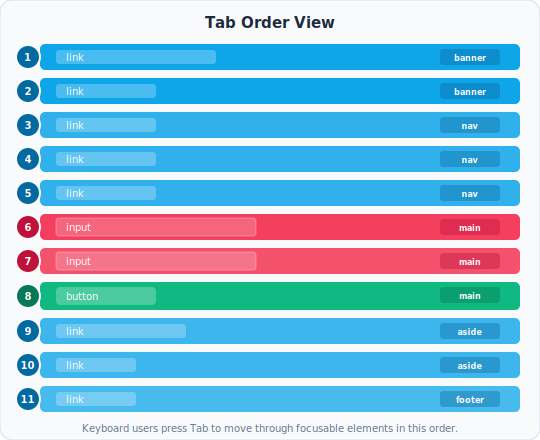

# Reading the TAB View

> The TAB view matches the output of [`tabSequenceSnapshot()`](/packages/testing#tabsequencesnapshot-root) in the testing package — same ordering, same formatting. Whether you're reading it in the Chrome extension, the Storybook addon, or a committed Playwright snapshot fixture, this page applies.

The TAB view answers one question: **can a keyboard user reach everything they need to, in the right order?**

It shows every focusable element on the page as a flat, numbered list — the exact sequence a user would encounter them by pressing Tab, from first to last. No nesting, no hierarchy. Just the order of keyboard focus.



<p style="color: var(--vp-c-text-3); font-size: 0.9em; margin-top: -0.5rem;">The color tells you the element type. The badge on the right tells you which section it came from. The number is the tab position.</p>

---

## What you see

Each row is one focusable element, in tab order. For each one you'll see:

- **A position number** — where in the tab sequence this element falls
- **The role** — `button`, `link`, `textbox`, `checkbox`, etc.
- **The accessible name** — what it's called (same as in the A11y view)
- **The HTML tag** — `<button>`, `<a>`, `<input>`, etc.
- **An amber `tabindex=N` badge** — only shown when the element has an explicit positive tabindex value (see below)

---

## How tab order works

Browsers determine tab order using two rules, applied in this sequence:

1. Elements with a **positive `tabindex`** (like `tabindex="1"`, `tabindex="2"`) come first, sorted from lowest to highest. Elements with the same value are sorted by their position in the document.
2. Everything else — elements with `tabindex="0"` or no tabindex at all — follows in **document order** (top to bottom, left to right).

Elements with `tabindex="-1"` are completely excluded. They're reachable programmatically (via JavaScript's `.focus()`), but invisible to the Tab key.

The TAB view reflects this computed order exactly.

---

## What to check

### Order matches the visual flow

Tab order should feel predictable. A user who can see the page expects focus to move left to right, top to bottom — the same way they'd read it. If someone tabs through a navigation bar and focus jumps to the footer before reaching the main content, something is wrong.

Compare the TAB view numbers to the visual layout of your page. If a `position: fixed` header contains the skip link at number 1 and the search field at number 2 — but the search field appears after a hundred nav items visually — keyboard users are in for a confusing ride.

### Every interactive element is reachable

Scan the list. Does every button, link, input, select, and interactive control appear? If something is missing, keyboard users can't reach it.

Common reasons an element is absent:
- It's a `<div>` or `<span>` with a click handler but no `tabindex` or `role`. It's mouse-only.
- It has `tabindex="-1"` — reachable by script, but not by Tab.
- It has `display: none`, `visibility: hidden`, or `aria-hidden="true"`.
- It has the `disabled` attribute (disabled elements are correctly excluded from tab order).

### Nothing unreachable appears in the list

The opposite problem: elements that show focus but shouldn't. A visually hidden element that's still in tab order means keyboard focus will land somewhere invisible — and the user will have no idea where they are.

This often happens with off-screen drawers or modals that haven't been properly hidden from the accessibility tree while closed.

### Amber badges — positive tabindex

If you see `tabindex=2` or `tabindex=5` badges, that's almost always a mistake. Here's why:

Positive tabindex values pull elements to the front of the tab queue, ahead of everything else in the document regardless of where they appear in the markup. The result is that focus jumps around the page in an order that doesn't match anything visual — disorienting for any keyboard user.

**The fix is to reorder the DOM**, not to manage tab order through `tabindex` values. Put elements in the document in the order you want them to be focused. Then tab order is natural and requires no maintenance.

The only legitimate use of `tabindex="-1"` is for programmatically managing focus (e.g., moving focus into a modal when it opens). Positive values beyond that are a code smell.

### Focus traps inside modals and dialogs

When a dialog is open, Tab should cycle only through elements inside it — it should never escape to the content behind. The TAB view will show you all focusable elements, so you can check whether the dialog contains everything it should and whether elements behind it are visible in the list when they shouldn't be.

A correct focus trap:
- Contains all interactive elements in the dialog
- Wraps from the last element back to the first when Tab is pressed at the end
- Returns focus to the trigger element when the dialog closes

---

## Common patterns and what they look like

**A healthy form**

```
1   textbox    "First name"      <input>
2   textbox    "Last name"       <input>
3   textbox    "Email address"   <input>
4   checkbox   "Subscribe"       <input>
5   button     "Create account"  <button>
6   link       "Sign in instead" <a>
```

Clean sequence, matches visual order, every field and action reachable.

---

**A broken icon toolbar**

```
1   button  (no name)  <button>
2   button  (no name)  <button>
3   button  (no name)  <button>
```

Three buttons in sequence — but no names. A keyboard user tabbing through hears: *"button, button, button."* Fix by adding `aria-label` to each icon button.

---

**Positive tabindex disrupting flow**

```
1   button  "Submit"   <button>   tabindex=1  ← jumps to front
2   link    "Home"     <a>        tabindex=2
3   textbox "Search"   <input>    (natural order, but reaches focus 3rd)
```

The Submit button and Home link appear first in the tab order even though they might be at the bottom of the document. Remove the tabindex values and reorder the HTML.

---

## The relationship to the A11y view

The TAB view and the A11y view are complementary. A11y shows you structure and labeling — whether elements have correct roles and names. TAB shows you reachability and order — whether keyboard users can get to those elements at all.

An element can have a perfect role and accessible name in the A11y view but still be unreachable if it's not focusable. Conversely, an element can appear in the TAB view with no useful name. You need both to get the full picture.
